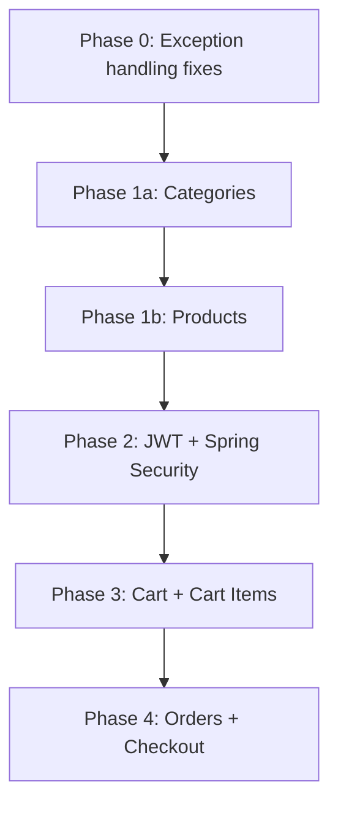
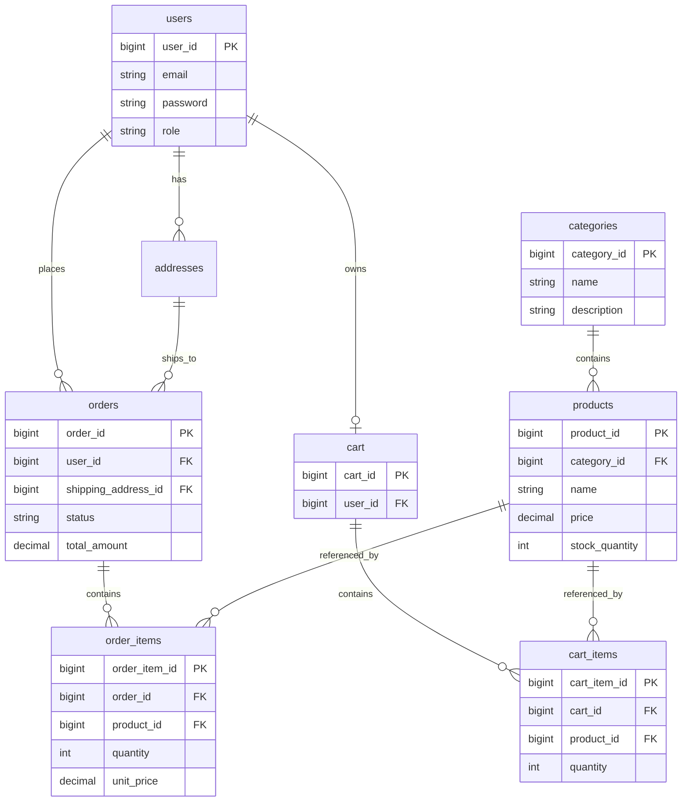

# Feature Roadmap

Actionable implementation guide for upcoming e-commerce modules. Complements the broader learning path in [`structured-project-plan.docs`](structured-project-plan.docs).

**API style:** RESTful paths with path variables  
**Auth:** JWT + Spring Security before cart and orders  
**Base URL prefix:** `/ecommerce/v1`

---

## Current baseline

| Module | Status |
|--------|--------|
| Users | Implemented — `UserController`, `UserService` |
| Addresses | Implemented — `AddressController`, `AddressService` |
| Products | DDL only in `schema.sql` — no Java code |
| Categories | Not started |
| Cart / Cart Items | Not started |
| Orders / Order Items | Not started |
| Authentication | Not started |

### Patterns to reuse

- Lombok entities and DTOs
- `@Service` + `@RequiredArgsConstructor` constructor injection
- `JpaRepository` with derived query methods
- Inline `toResponseDto()` mapping in services
- `GlobalExceptionHandler` for domain exceptions

### Conventions to adopt for new modules

- Return DTOs from controllers (not entities)
- Use `ResourceNotFoundException` instead of raw `RuntimeException`
- RESTful paths: `GET /products/{productId}` instead of header-based IDs
- Align primary key naming: `productId`, `categoryId`, `orderId` (not bare `id`)
- Add `category_id` foreign key on products

---

## Implementation phases

| Phase | Scope | Depends on |
|-------|-------|------------|
| **0** | Foundation fixes (exceptions, DTO-only responses) | — |
| **1** | Categories + Products (catalog) | Users |
| **2** | Authentication & roles (JWT, Spring Security) | Users |
| **3** | Cart + Cart Items | Auth |
| **4** | Orders + Order Items (checkout) | Cart, Products, Addresses |
| **5** | Cross-cutting (pagination, OpenAPI, tests) | All above |



---

## Data model



---

## Database schema

Add the following to [`schema.sql`](schema.sql).

### Categories

```sql
CREATE TABLE categories (
    category_id BIGSERIAL PRIMARY KEY,
    name VARCHAR(255) NOT NULL UNIQUE,
    description TEXT,
    created_at TIMESTAMP(0) DEFAULT CURRENT_TIMESTAMP,
    updated_at TIMESTAMP(0) DEFAULT CURRENT_TIMESTAMP
);
```

### Products

```sql
CREATE TABLE products (
    product_id BIGSERIAL PRIMARY KEY,
    category_id BIGINT NOT NULL,
    name VARCHAR(255) NOT NULL,
    description TEXT,
    price DECIMAL(10, 2) NOT NULL,
    stock_quantity INT NOT NULL DEFAULT 0,
    created_at TIMESTAMP(0) DEFAULT CURRENT_TIMESTAMP,
    updated_at TIMESTAMP(0) DEFAULT CURRENT_TIMESTAMP,
    CONSTRAINT fk_product_category
        FOREIGN KEY (category_id)
        REFERENCES categories(category_id)
);

CREATE INDEX idx_products_category_id ON products(category_id);
```

### Cart

One cart per user.

```sql
CREATE TABLE cart (
    cart_id BIGSERIAL PRIMARY KEY,
    user_id BIGINT NOT NULL UNIQUE,
    created_at TIMESTAMP(0) DEFAULT CURRENT_TIMESTAMP,
    updated_at TIMESTAMP(0) DEFAULT CURRENT_TIMESTAMP,
    CONSTRAINT fk_cart_user
        FOREIGN KEY (user_id)
        REFERENCES users(user_id)
);
```

### Cart items

```sql
CREATE TABLE cart_items (
    cart_item_id BIGSERIAL PRIMARY KEY,
    cart_id BIGINT NOT NULL,
    product_id BIGINT NOT NULL,
    quantity INT NOT NULL CHECK (quantity > 0),
    created_at TIMESTAMP(0) DEFAULT CURRENT_TIMESTAMP,
    updated_at TIMESTAMP(0) DEFAULT CURRENT_TIMESTAMP,
    CONSTRAINT fk_cart_item_cart
        FOREIGN KEY (cart_id)
        REFERENCES cart(cart_id),
    CONSTRAINT fk_cart_item_product
        FOREIGN KEY (product_id)
        REFERENCES products(product_id),
    CONSTRAINT uq_cart_product UNIQUE (cart_id, product_id)
);
```

### Orders

```sql
CREATE TABLE orders (
    order_id BIGSERIAL PRIMARY KEY,
    user_id BIGINT NOT NULL,
    shipping_address_id BIGINT NOT NULL,
    status VARCHAR(20) NOT NULL DEFAULT 'PENDING',
    total_amount DECIMAL(10, 2) NOT NULL,
    created_at TIMESTAMP(0) DEFAULT CURRENT_TIMESTAMP,
    updated_at TIMESTAMP(0) DEFAULT CURRENT_TIMESTAMP,
    CONSTRAINT fk_order_user
        FOREIGN KEY (user_id)
        REFERENCES users(user_id),
    CONSTRAINT fk_order_address
        FOREIGN KEY (shipping_address_id)
        REFERENCES addresses(address_id)
);

CREATE INDEX idx_orders_user_id ON orders(user_id);
```

### Order items

`unit_price` is a snapshot at checkout time.

```sql
CREATE TABLE order_items (
    order_item_id BIGSERIAL PRIMARY KEY,
    order_id BIGINT NOT NULL,
    product_id BIGINT NOT NULL,
    quantity INT NOT NULL CHECK (quantity > 0),
    unit_price DECIMAL(10, 2) NOT NULL,
    created_at TIMESTAMP(0) DEFAULT CURRENT_TIMESTAMP,
    CONSTRAINT fk_order_item_order
        FOREIGN KEY (order_id)
        REFERENCES orders(order_id),
    CONSTRAINT fk_order_item_product
        FOREIGN KEY (product_id)
        REFERENCES products(product_id)
);

CREATE INDEX idx_order_items_order_id ON order_items(order_id);
```

### Users — role column (Phase 2)

```sql
ALTER TABLE users ADD COLUMN role VARCHAR(20) NOT NULL DEFAULT 'CUSTOMER';
```

---

## Enums

### `AddressType` (existing)

`SHIPPING`, `BILLING`, `OFFICE`, `HOME`, `OTHER`

### `UserRole` (new — Phase 2)

`ADMIN`, `CUSTOMER`

### `OrderStatus` (new — Phase 4)

`PENDING`, `CONFIRMED`, `SHIPPED`, `DELIVERED`, `CANCELLED`

---

## Java file checklist

### Phase 1 — Categories & Products

| Layer | Files |
|-------|-------|
| `entity/` | `CategoryEntity.java`, `ProductEntity.java` |
| `repository/` | `CategoryRepository.java`, `ProductRepository.java` |
| `dto/` | `CategoryRequestDto`, `CategoryResponseDto`, `ProductRequestDto`, `ProductResponseDto` |
| `service/` | `CategoryService.java`, `ProductService.java` |
| `controller/` | `CategoryController.java`, `ProductController.java` |
| `exception/` | `CategoryNotFoundException.java`, `ProductNotFoundException.java` |

### Phase 2 — Authentication

| Layer | Files |
|-------|-------|
| `enums/` | `UserRole.java` |
| `config/` | `SecurityConfig.java`, `JwtUtil.java`, `JwtAuthFilter.java` |
| `dto/` | `AuthRequestDto`, `AuthResponseDto`, `RegisterRequestDto` |
| `service/` | `AuthService.java` (or extend `UserService`) |
| `controller/` | `AuthController.java` |

Update `UserEntity` with `role` field. Encode passwords with BCrypt.

### Phase 3 — Cart

| Layer | Files |
|-------|-------|
| `entity/` | `CartEntity.java`, `CartItemEntity.java` |
| `repository/` | `CartRepository.java`, `CartItemRepository.java` |
| `dto/` | `CartResponseDto`, `CartItemRequestDto`, `CartItemResponseDto` |
| `service/` | `CartService.java` |
| `controller/` | `CartController.java` |
| `exception/` | `OutOfStockException.java`, `CartItemNotFoundException.java` |

### Phase 4 — Orders

| Layer | Files |
|-------|-------|
| `enums/` | `OrderStatus.java` |
| `entity/` | `OrderEntity.java`, `OrderItemEntity.java` |
| `repository/` | `OrderRepository.java`, `OrderItemRepository.java` |
| `dto/` | `CheckoutRequestDto`, `OrderResponseDto`, `OrderItemResponseDto` |
| `service/` | `OrderService.java` |
| `controller/` | `OrderController.java` |
| `exception/` | `OrderNotFoundException.java`, `InvalidOrderStateException.java` |

---

## REST API reference

### Categories — `/ecommerce/v1/categories`

| Method | Path | Auth | Description |
|--------|------|------|-------------|
| `GET` | `/` | Public | List all categories |
| `GET` | `/{categoryId}` | Public | Get category by ID |
| `POST` | `/` | ADMIN | Create category |
| `PUT` | `/{categoryId}` | ADMIN | Update category |
| `DELETE` | `/{categoryId}` | ADMIN | Delete category |

### Products — `/ecommerce/v1/products`

| Method | Path | Auth | Description |
|--------|------|------|-------------|
| `GET` | `/` | Public | List products (`?categoryId=` optional) |
| `GET` | `/{productId}` | Public | Get product by ID |
| `POST` | `/` | ADMIN | Create product |
| `PUT` | `/{productId}` | ADMIN | Update product |
| `DELETE` | `/{productId}` | ADMIN | Delete product |

### Auth — `/ecommerce/v1/auth`

| Method | Path | Auth | Description |
|--------|------|------|-------------|
| `POST` | `/register` | Public | Register new customer |
| `POST` | `/login` | Public | Login, returns JWT token |

**Login response example:**

```json
{
  "token": "eyJhbGciOiJIUzI1NiJ9...",
  "userId": 1,
  "email": "user@example.com",
  "role": "CUSTOMER"
}
```

### Cart — `/ecommerce/v1/cart`

All endpoints require a valid JWT (`Authorization: Bearer <token>`).

| Method | Path | Description |
|--------|------|-------------|
| `GET` | `/` | View cart with items |
| `POST` | `/items` | Add or update item (`productId`, `quantity`) |
| `PUT` | `/items/{cartItemId}` | Update item quantity |
| `DELETE` | `/items/{cartItemId}` | Remove item |
| `DELETE` | `/` | Clear cart |

### Orders — `/ecommerce/v1/orders`

All endpoints require a valid JWT.

| Method | Path | Description |
|--------|------|-------------|
| `POST` | `/checkout` | Create order from cart (`shippingAddressId`) |
| `GET` | `/` | List current user's orders |
| `GET` | `/{orderId}` | Order detail with items |
| `PATCH` | `/{orderId}/cancel` | Cancel order (only if `PENDING`) |

### Existing endpoints (legacy style — migrate later)

User and address endpoints use the older verb-in-path style (`/createUser`, `/createAddress`, header-based IDs). New modules use RESTful paths above. Migration of legacy endpoints is out of scope for now.

---

## Business rules

### Catalog

- Category `name` must be unique.
- Product must belong to an existing category.
- `stock_quantity` cannot be negative.
- Deleting a category should be blocked if products still reference it (or cascade-delete products — pick one and document the choice).

### Cart

- One cart per user; create lazily on first `POST /cart/items`.
- `quantity` must be greater than 0.
- If the same product is added again, update quantity instead of creating a duplicate row (enforced by `UNIQUE (cart_id, product_id)`).
- Validate stock availability on add and update; throw `OutOfStockException` if `quantity > stock_quantity`.

### Checkout (`@Transactional`)

1. Validate cart is not empty.
2. Validate shipping address belongs to the authenticated user.
3. Re-check stock for every cart item.
4. Create `orders` row with status `PENDING`.
5. Create `order_items` rows; copy `unit_price` from product at checkout time.
6. Decrement `stock_quantity` on each product.
7. Clear cart items.
8. Roll back entire transaction on any failure.

### Orders

- Users can only view their own orders.
- Cancel is allowed only when status is `PENDING`.
- On cancel, restore product stock quantities.

### Roles

| Role | Permissions |
|------|-------------|
| `ADMIN` | Create, update, delete categories and products |
| `CUSTOMER` | Browse catalog, manage cart, place and view orders |

---

## JPA relationship guidance

| Module | Approach |
|--------|----------|
| **Products** | `@ManyToOne CategoryEntity category` on `ProductEntity`; expose `categoryId` in DTOs |
| **Cart** | `@OneToMany(mappedBy = "cart", cascade = CascadeType.ALL, orphanRemoval = true)` on `CartEntity` |
| **Cart items** | `@ManyToOne CartEntity cart`, `@ManyToOne ProductEntity product` |
| **Orders** | `@OneToMany` for order items with `cascade = CascadeType.ALL` |
| **Order items** | `@ManyToOne OrderEntity order`, `@ManyToOne ProductEntity product` |
| **Addresses** | Keep existing `Long userId` pattern (no refactor in scope) |

---

## Dependencies (Phase 2)

Add to `pom.xml`:

```xml
<!-- Spring Security -->
<dependency>
    <groupId>org.springframework.boot</groupId>
    <artifactId>spring-boot-starter-security</artifactId>
</dependency>

<!-- JWT -->
<dependency>
    <groupId>io.jsonwebtoken</groupId>
    <artifactId>jjwt-api</artifactId>
    <version>0.12.6</version>
</dependency>
<dependency>
    <groupId>io.jsonwebtoken</groupId>
    <artifactId>jjwt-impl</artifactId>
    <version>0.12.6</version>
    <scope>runtime</scope>
</dependency>
<dependency>
    <groupId>io.jsonwebtoken</groupId>
    <artifactId>jjwt-jackson</artifactId>
    <version>0.12.6</version>
    <scope>runtime</scope>
</dependency>
```

Optional later (Phase 5):

```xml
<dependency>
    <groupId>org.springdoc</groupId>
    <artifactId>springdoc-openapi-starter-webmvc-ui</artifactId>
    <version>2.8.4</version>
</dependency>
```

---

## Phase 0 — Foundation fixes

Before building new modules, tighten the existing codebase:

1. Fix `ResourceNotFoundException` — add proper constructor and message field.
2. Register handlers in `GlobalExceptionHandler` for:
   - `ResourceNotFoundException` → 404
   - `MethodArgumentNotValidException` → 400
   - Domain exceptions (`ProductNotFoundException`, etc.)
3. Replace `RuntimeException` in `AddressService` and `UserService` with `ResourceNotFoundException`.
4. Return DTOs from address `GET /all` instead of entities.
5. Remove `createdAt`/`updatedAt` from `UserService.toResponseDto()` or add them to `UserResponseDto`.

---

## Phase-by-phase implementation steps

### Phase 1 — Categories & Products

1. Add DDL to `schema.sql`.
2. Create `CategoryEntity`, repository, DTOs, service, controller.
3. Create `ProductEntity` with `@ManyToOne CategoryEntity`.
4. Implement CRUD for both modules.
5. Register `CategoryNotFoundException` and `ProductNotFoundException` in `GlobalExceptionHandler`.

### Phase 2 — Authentication

1. Add Security + JWT dependencies.
2. Add `role` column and `UserRole` enum to `UserEntity`.
3. Create `SecurityConfig`, `JwtUtil`, `JwtAuthFilter`.
4. Create `AuthController` with `/register` and `/login`.
5. BCrypt-encode passwords on user creation.
6. Protect endpoints:
   - Public: `GET` categories/products, auth routes, health check
   - `ADMIN`: catalog write operations
   - Authenticated: cart and order routes

### Phase 3 — Cart

1. Add `cart` and `cart_items` DDL.
2. Create entities with JPA associations.
3. Implement `CartService`:
   - `getOrCreateCart(userId)`
   - `addItem(userId, productId, quantity)`
   - `updateItem(userId, cartItemId, quantity)`
   - `removeItem(userId, cartItemId)`
   - `clearCart(userId)`
4. Create `CartController`; resolve `userId` from JWT principal.

### Phase 4 — Orders

1. Add `orders` and `order_items` DDL.
2. Create entities and repositories.
3. Implement `OrderService.checkout(userId, shippingAddressId)` with `@Transactional`.
4. Implement list, detail, and cancel endpoints.
5. On cancel (`PENDING` only), restore stock and set status to `CANCELLED`.

---

## Out of scope (future phases)

These are covered in [`structured-project-plan.docs`](structured-project-plan.docs) and are not part of this roadmap:

- Payment integration (Stripe)
- Redis caching
- Kafka event-driven architecture
- Microservices split
- Docker Compose setup
- Elasticsearch / full-text search
- CI/CD and AWS deployment

---

## Quick reference — package layout

```
src/main/java/com/furqan/ecommerce/
├── controller/
│   ├── CategoryController.java      (Phase 1)
│   ├── ProductController.java       (Phase 1)
│   ├── AuthController.java          (Phase 2)
│   ├── CartController.java          (Phase 3)
│   └── OrderController.java         (Phase 4)
├── service/
│   ├── CategoryService.java
│   ├── ProductService.java
│   ├── AuthService.java
│   ├── CartService.java
│   └── OrderService.java
├── repository/
│   ├── CategoryRepository.java
│   ├── ProductRepository.java
│   ├── CartRepository.java
│   ├── CartItemRepository.java
│   ├── OrderRepository.java
│   └── OrderItemRepository.java
├── entity/
│   ├── CategoryEntity.java
│   ├── ProductEntity.java
│   ├── CartEntity.java
│   ├── CartItemEntity.java
│   ├── OrderEntity.java
│   └── OrderItemEntity.java
├── dto/
│   └── (request/response DTOs per module)
├── enums/
│   ├── AddressType.java             (existing)
│   ├── UserRole.java                (Phase 2)
│   └── OrderStatus.java             (Phase 4)
├── exception/
│   └── (domain exceptions + GlobalExceptionHandler)
└── config/
    ├── SecurityConfig.java          (Phase 2)
    ├── JwtUtil.java
    └── JwtAuthFilter.java
```
