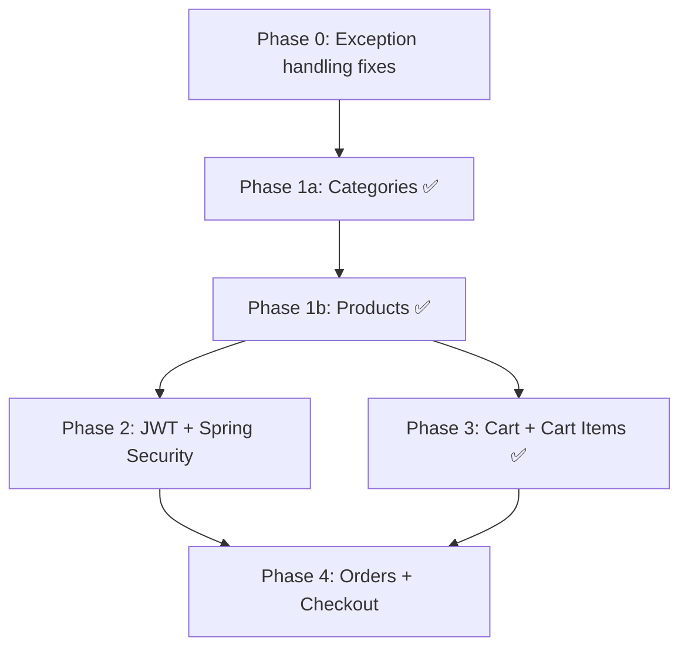
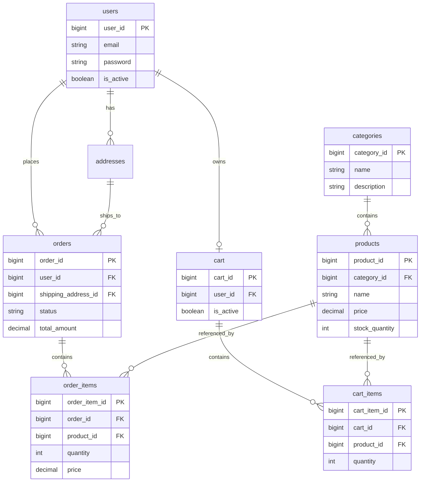

# Feature Roadmap

Actionable implementation guide for the e-commerce platform. Complements the broader learning path in [`structured-project-plan.docs`](structured-project-plan.docs).

**Last updated:** June 2026  
**Branch:** `shopping-module`  
**Base URL prefix:** `/ecommerce/v1`

**API style (current):** Legacy verb-in-path + header-based IDs (`user_id`, `product_id`)  
**API style (target):** RESTful paths with path variables  
**Auth (target):** JWT + Spring Security before production cart/orders

---

## Current baseline

| Module | Status |
|--------|--------|
| Users | ✅ Implemented — `UserController`, `UserService` |
| Addresses | ✅ Implemented — `AddressController`, `AddressService` |
| Categories | ✅ Implemented — `CategoryController`, `CategoryService` |
| Products | ✅ Implemented — `ProductController`, `ProductService` |
| Cart / Cart Items | ✅ Implemented — `CartController`, `CartService` |
| Orders / Order Items | ⬜ DDL in `schema.sql` only — no Java code |
| Authentication | ⬜ Not started |
| Exception handling | 🔄 Partial — domain exceptions for users, products, cart; `RuntimeException` still in category/address services |

### Patterns in use

- Lombok entities and DTOs
- `@Service` + `@RequiredArgsConstructor` constructor injection
- `JpaRepository` with derived query methods (`IUserRepository`, `IProductRepository`, etc.)
- Inline `toResponseDto()` mapping in services
- `GlobalExceptionHandler` for domain exceptions
- DTO sub-packages: `dto/user`, `dto/address`, `dto/category`, `dto/product`, `dto/cart`, `dto/common`

### Conventions still to adopt

- Return DTOs from all controllers (Category/Address `GET /all` still return entities)
- Replace remaining `RuntimeException` with domain exceptions in Category/Address services
- RESTful paths: `GET /products/{productId}` instead of header-based IDs (migration later)
- BCrypt password hashing (passwords currently plain text)
- JWT-based user identity instead of `user_id` header/body

---

## Implementation phases

| Phase | Scope | Status | Depends on |
|-------|-------|--------|------------|
| **0** | Foundation fixes (exceptions, DTO-only responses) | 🔄 In progress | — |
| **1** | Categories + Products (catalog) | ✅ Done | Users |
| **2** | Authentication & roles (JWT, Spring Security) | ⬜ Next | Users |
| **3** | Cart + Cart Items | ✅ Done (polish remaining) | Users, Products |
| **4** | Orders + Order Items (checkout) | ⬜ Coming | Cart, Products, Addresses |
| **5** | Cross-cutting (pagination, OpenAPI, tests) | ⬜ Not started | All above |



---

## Data model



**JPA note:** Entities use `Long` FK columns (not `@ManyToOne` mappings) except where noted in guidance below.

---

## Database schema

**Status:** ✅ All DDL present in [`schema.sql`](schema.sql) with seed data.

| Table | DDL | JPA Entity |
|-------|-----|------------|
| `users` | ✅ | ✅ `UserEntity` |
| `addresses` | ✅ | ✅ `AddressEntity` |
| `categories` | ✅ | ✅ `CategoryEntity` |
| `products` | ✅ | ✅ `ProductEntity` |
| `cart` | ✅ | ✅ `CartEntity` |
| `cart_items` | ✅ | ✅ `CartItemEntity` |
| `orders` | ✅ | ⬜ Not created |
| `order_items` | ✅ | ⬜ Not created |

Actual `orders` schema includes: `order_number`, `payment_status`, `billing_address_id` (see `schema.sql`).

### Users — role column (Phase 2 — not yet applied)

```sql
ALTER TABLE users ADD COLUMN role VARCHAR(20) NOT NULL DEFAULT 'CUSTOMER';
```

---

## Enums

### `AddressType` — ✅ existing

`SHIPPING`, `BILLING`, `OFFICE`, `HOME`, `OTHER`

### `UserRole` — ⬜ Phase 2

`ADMIN`, `CUSTOMER`

### `OrderStatus` — ⬜ Phase 4

`CREATED`, `CONFIRMED`, `SHIPPED`, `DELIVERED`, `CANCELLED` (align with `schema.sql` defaults)

---

## Java file checklist

### Phase 1 — Categories & Products — ✅ Done

| Layer | Files | Status |
|-------|-------|--------|
| `entity/` | `CategoryEntity.java`, `ProductEntity.java` | ✅ |
| `repository/` | `ICategoryRepository.java`, `IProductRepository.java` | ✅ |
| `dto/` | `category/*`, `product/*` | ✅ |
| `service/` | `CategoryService.java`, `ProductService.java` | ✅ |
| `controller/` | `CategoryController.java`, `ProductController.java` | ✅ |
| `exception/` | `CategoryNotFoundException.java`, `ProductNotFoundException.java` | ✅ |

### Phase 2 — Authentication — ⬜ Not started

| Layer | Files |
|-------|-------|
| `enums/` | `UserRole.java` |
| `config/` | `SecurityConfig.java`, `JwtUtil.java`, `JwtAuthFilter.java` |
| `dto/` | `AuthRequestDto`, `AuthResponseDto`, `RegisterRequestDto` |
| `service/` | `AuthService.java` (or extend `UserService`) |
| `controller/` | `AuthController.java` |

Update `UserEntity` with `role` field. Encode passwords with BCrypt.

### Phase 3 — Cart — ✅ Done (polish remaining)

| Layer | Files | Status |
|-------|-------|--------|
| `entity/` | `CartEntity.java`, `CartItemEntity.java` | ✅ |
| `repository/` | `ICartRepository.java`, `ICartItemRepository.java` | ✅ |
| `dto/cart/` | `CartResponseDto`, `AddCartItemRequestDto`, `CartItemResponseDto`, etc. | ✅ |
| `service/` | `CartService.java` | ✅ |
| `controller/` | `CartController.java` | ✅ |
| `exception/` | `OutOfStockException.java`, `CartItemNotFoundException.java`, `CartNotFoundException.java` | ✅ |

**Remaining cart polish:**
- [ ] `clearCart` endpoint
- [ ] Cart item ownership validation on remove/update
- [ ] Consistent `getCart` behavior when no cart exists (auto-create vs 404)
- [ ] Remove duplicate `dto/cartItem/` package

### Phase 4 — Orders — ⬜ Not started

| Layer | Files |
|-------|-------|
| `enums/` | `OrderStatus.java` |
| `entity/` | `OrderEntity.java`, `OrderItemEntity.java` |
| `repository/` | `IOrderRepository.java`, `IOrderItemRepository.java` |
| `dto/` | `CheckoutRequestDto`, `OrderResponseDto`, `OrderItemResponseDto` |
| `service/` | `OrderService.java` |
| `controller/` | `OrderController.java` |
| `exception/` | `OrderNotFoundException.java`, `InvalidOrderStateException.java` |

---

## REST API reference

### Implemented endpoints (actual — legacy style)

#### Users — `/ecommerce/v1/users`

| Method | Path | Description |
|--------|------|-------------|
| `GET` | `/all` | List all users (DTO) |
| `GET` | `/user` | Get user by ID (header: `user_id`) |
| `POST` | `/createUser` | Create user |
| `PATCH` | `/updateUser` | Partial update (body includes `user_id`) |
| `PATCH` | `/isActive` | Toggle active status |
| `DELETE` | `/deleteUser` | Delete user (header: `user_id`) |

#### Addresses — `/ecommerce/v1/addresses`

| Method | Path | Description |
|--------|------|-------------|
| `GET` | `/all` | List all addresses (entity — migrate to DTO) |
| `GET` | `/addressId` | Get by ID (header: `address_id`) |
| `GET` | `/userAddress` | List addresses for user (header: `user_id`) |
| `POST` | `/createAddress` | Create address |
| `PATCH` | `/updateAddress` | Update address |
| `DELETE` | `/deleteAddress` | Delete address (header: `address_id`) |

#### Categories — `/ecommerce/v1/categories`

| Method | Path | Description |
|--------|------|-------------|
| `GET` | `/all` | List all categories (entity — migrate to DTO) |
| `GET` | `/categoryId` | Get by ID (header: `category_id`) |
| `GET` | `/getCategory` | Get by name (header: `category_name`) |
| `POST` | `/createCategory` | Create category |
| `PATCH` | `/updateCategory` | Update category |
| `DELETE` | `/deleteCategoryById` | Delete by ID (header: `category_id`) |
| `DELETE` | `/deleteCategoryByName` | Delete by name (header: `category_name`) |

#### Products — `/ecommerce/v1/products`

| Method | Path | Description |
|--------|------|-------------|
| `GET` | `/all` | List all products (DTO) |
| `GET` | `/productId` | Get by ID (header: `product_id`) |
| `GET` | `/productByName` | Get by name (`?name=`) |
| `GET` | `/productsByCategoryId` | List by category (`?categoryId=`) |
| `POST` | `/addProduct` | Create product (category validated) |
| `PATCH` | `/updateProduct` | Update product |
| `DELETE` | `/productId` | Delete product (header: `product_id`) |

#### Cart — `/ecommerce/v1/cart`

| Method | Path | Description |
|--------|------|-------------|
| `POST` | `/createCart` | Create or return existing cart |
| `POST` | `/addItem` | Add/increment product in cart |
| `GET` | `/getCart` | View cart with items and total (header: `user_id`) |
| `PATCH` | `/updateQuantity` | Update item quantity |
| `DELETE` | `/removeItem` | Remove cart line item |

#### Health

| Method | Path | Description |
|--------|------|-------------|
| `GET` | `/` | Welcome message |

---

### Target endpoints (after auth + REST migration)

#### Categories — `/ecommerce/v1/categories`

| Method | Path | Auth | Description |
|--------|------|------|-------------|
| `GET` | `/` | Public | List all categories |
| `GET` | `/{categoryId}` | Public | Get category by ID |
| `POST` | `/` | ADMIN | Create category |
| `PUT` | `/{categoryId}` | ADMIN | Update category |
| `DELETE` | `/{categoryId}` | ADMIN | Delete category |

#### Products — `/ecommerce/v1/products`

| Method | Path | Auth | Description |
|--------|------|------|-------------|
| `GET` | `/` | Public | List products (`?categoryId=` optional) |
| `GET` | `/{productId}` | Public | Get product by ID |
| `POST` | `/` | ADMIN | Create product |
| `PUT` | `/{productId}` | ADMIN | Update product |
| `DELETE` | `/{productId}` | ADMIN | Delete product |

#### Auth — `/ecommerce/v1/auth` — ⬜ Phase 2

| Method | Path | Auth | Description |
|--------|------|------|-------------|
| `POST` | `/register` | Public | Register new customer |
| `POST` | `/login` | Public | Login, returns JWT token |

**Login response example:**

```json
{
  "token": "eyJhbGciOiJIUzI1NiJ9...",
  "userId": 1,
  "email": "user@example.com",
  "role": "CUSTOMER"
}
```

#### Cart — `/ecommerce/v1/cart` (target — JWT protected)

| Method | Path | Description |
|--------|------|-------------|
| `GET` | `/` | View cart with items |
| `POST` | `/items` | Add or update item (`productId`, `quantity`) |
| `PUT` | `/items/{cartItemId}` | Update item quantity |
| `DELETE` | `/items/{cartItemId}` | Remove item |
| `DELETE` | `/` | Clear cart |

#### Orders — `/ecommerce/v1/orders` — ⬜ Phase 4

| Method | Path | Description |
|--------|------|-------------|
| `POST` | `/checkout` | Create order from cart (`shippingAddressId`) |
| `GET` | `/` | List current user's orders |
| `GET` | `/{orderId}` | Order detail with items |
| `PATCH` | `/{orderId}/cancel` | Cancel order (only if `PENDING`/`CREATED`) |

---

## Business rules

### Catalog — ✅ implemented (with gaps)

- ✅ Category `name` must be unique (DB constraint).
- ✅ Product must belong to an existing category (`CategoryNotFoundException` on add/update/list).
- ✅ `stock_quantity` cannot be negative (DB check + `@Min(0)` on DTO).
- ⬜ Default `stockQuantity` to `0` when omitted on create.
- ⬜ Deleting a category blocked if products reference it (currently FK error → 500).

### Cart — ✅ implemented (with gaps)

- ✅ One cart per user; create on `createCart` / `addItem`.
- ✅ `quantity` must be greater than 0 (`@Min(1)` on DTOs).
- ✅ Same product merged — `UNIQUE (cart_id, product_id)`.
- ✅ Stock validated on add and update — `OutOfStockException`.
- ⬜ `getCart` returns 404 if cart never created (inconsistent with `addItem`).
- ⬜ No ownership check on remove/update by `cartItemId`.
- ⬜ No `clearCart` endpoint.

### Checkout (`@Transactional`) — ⬜ Phase 4

1. Validate cart is not empty.
2. Validate shipping address belongs to the authenticated user.
3. Re-check stock for every cart item.
4. Create `orders` row with status `CREATED` / `PENDING`.
5. Create `order_items` rows; copy price snapshot at checkout time.
6. Decrement `stock_quantity` on each product.
7. Clear cart items.
8. Roll back entire transaction on any failure.

### Orders — ⬜ Phase 4

- Users can only view their own orders.
- Cancel allowed only when status is `PENDING` / `CREATED`.
- On cancel, restore product stock quantities.

### Roles — ⬜ Phase 2

| Role | Permissions |
|------|-------------|
| `ADMIN` | Create, update, delete categories and products |
| `CUSTOMER` | Browse catalog, manage cart, place and view orders |

---

## JPA relationship guidance

| Module | Approach | Current |
|--------|----------|---------|
| **Products** | `@ManyToOne CategoryEntity category` on `ProductEntity` | `Long categoryId` FK column |
| **Cart** | `@OneToMany(mappedBy = "cart", cascade = ALL, orphanRemoval = true)` | `Long cartId` on `CartItemEntity` |
| **Cart items** | `@ManyToOne CartEntity cart`, `@ManyToOne ProductEntity product` | `Long` FK columns |
| **Orders** | `@OneToMany` for order items with `cascade = ALL` | Not implemented |
| **Order items** | `@ManyToOne OrderEntity order`, `@ManyToOne ProductEntity product` | Not implemented |
| **Addresses** | Keep `Long userId` pattern | ✅ `Long userId` |

Refactoring to JPA associations is optional; current `Long` FK pattern works.

---

## Dependencies

### Phase 2 — add to `pom.xml` (not yet added)

```xml
<!-- Spring Security -->
<dependency>
    <groupId>org.springframework.boot</groupId>
    <artifactId>spring-boot-starter-security</artifactId>
</dependency>

<!-- JWT -->
<dependency>
    <groupId>io.jsonwebtoken</groupId>
    <artifactId>jjwt-api</artifactId>
    <version>0.12.6</version>
</dependency>
<dependency>
    <groupId>io.jsonwebtoken</groupId>
    <artifactId>jjwt-impl</artifactId>
    <version>0.12.6</version>
    <scope>runtime</scope>
</dependency>
<dependency>
    <groupId>io.jsonwebtoken</groupId>
    <artifactId>jjwt-jackson</artifactId>
    <version>0.12.6</version>
    <scope>runtime</scope>
</dependency>
```

### Phase 5 — optional

```xml
<dependency>
    <groupId>org.springdoc</groupId>
    <artifactId>springdoc-openapi-starter-webmvc-ui</artifactId>
    <version>2.8.4</version>
</dependency>
```

---

## Phase 0 — Foundation fixes

**Status:** 🔄 In progress

### Done

- ✅ `GlobalExceptionHandler` with handlers for validation, user, product, category, cart exceptions
- ✅ `ProductNotFoundException`, `CategoryNotFoundException` with message constructors
- ✅ `UserNotFoundException`, `UserAlreadyExistsException`
- ✅ `CartNotFoundException`, `CartItemNotFoundException`, `OutOfStockException`
- ✅ `UserService.getUserById` returns DTO; email update bug fixed
- ✅ `AddressController.getAddressesByUserId` calls `addressService`
- ✅ Product module returns DTOs; category validation on add/update

### Remaining

1. Replace `RuntimeException` in `CategoryService` and `AddressService` with domain exceptions.
2. Add `AddressNotFoundException` + handler.
3. Handler for `DataIntegrityViolationException` (FK delete failures → 409).
4. Return DTOs from Category/Address `GET /all` instead of entities.
5. `UserController.updateUser` — use DTO + `@Valid` instead of raw `Map`.
6. `UserRequestDto` — `@NotNull` on required create fields.
7. `AddressRequestDto` — align NOT NULL fields with DB (`city`, `state`, `pinCode`, `country`).
8. `AddressService.createAddress` — validate user exists.
9. `AddressService.getAddressesByUserId` — return `[]` when empty (not throw).
10. `ProductService.addProduct` — default `stockQuantity` to `0` if null.
11. Remove duplicate `dto/cartItem/` package.

---

## Phase-by-phase implementation steps

### Phase 1 — Categories & Products — ✅ Done

1. ✅ DDL in `schema.sql`.
2. ✅ Entities, repositories, DTOs, services, controllers.
3. ✅ CRUD for both modules.
4. ✅ `CategoryNotFoundException` and `ProductNotFoundException` in `GlobalExceptionHandler`.

### Phase 2 — Authentication — ⬜ Next

1. Add Security + JWT dependencies.
2. Add `role` column and `UserRole` enum to `UserEntity`.
3. Create `SecurityConfig`, `JwtUtil`, `JwtAuthFilter`.
4. Create `AuthController` with `/register` and `/login`.
5. BCrypt-encode passwords on user creation and update.
6. Protect endpoints:
   - Public: `GET` categories/products, auth routes, health check
   - `ADMIN`: catalog write operations
   - Authenticated: cart and order routes

### Phase 3 — Cart — ✅ Done (polish remaining)

1. ✅ `cart` and `cart_items` DDL.
2. ✅ Entities and repositories.
3. ✅ `CartService`: `createCart`, `addItem`, `updateQuantity`, `removeItem`, `getCart`.
4. ✅ `CartController` with stock validation and totals.
5. ⬜ `clearCart(userId)`.
6. ⬜ Resolve `userId` from JWT principal (after Phase 2).

### Phase 4 — Orders — ⬜ Coming

1. ✅ `orders` and `order_items` DDL (already in `schema.sql`).
2. Create `OrderEntity`, `OrderItemEntity`, repositories.
3. Implement `OrderService.checkout(userId, shippingAddressId, billingAddressId)` with `@Transactional`.
4. Implement list, detail, and cancel endpoints.
5. On cancel, restore stock and set status to `CANCELLED`.

### Phase 5 — Cross-cutting — ⬜ Not started

1. springdoc-openapi / Swagger UI.
2. JUnit 5 + Mockito service tests.
3. Integration tests with TestContainers.
4. Pagination on list endpoints.

---

## Out of scope (future phases)

Covered in [`structured-project-plan.docs`](structured-project-plan.docs):

- Payment integration (Stripe)
- Redis caching
- Kafka event-driven architecture
- Microservices split
- Docker Compose setup
- Elasticsearch / full-text search
- CI/CD and AWS deployment

---

## Quick reference — package layout

```
src/main/java/com/furqan/ecommerce/
├── controller/
│   ├── UserController.java          ✅
│   ├── AddressController.java       ✅
│   ├── CategoryController.java      ✅
│   ├── ProductController.java       ✅
│   ├── CartController.java          ✅
│   ├── HealthController.java        ✅
│   ├── AuthController.java          ⬜ Phase 2
│   └── OrderController.java         ⬜ Phase 4
├── service/
│   ├── UserService.java             ✅
│   ├── AddressService.java          ✅ (polish)
│   ├── CategoryService.java         ✅ (polish)
│   ├── ProductService.java          ✅
│   ├── CartService.java             ✅ (polish)
│   ├── AuthService.java             ⬜ Phase 2
│   └── OrderService.java            ⬜ Phase 4
├── repository/
│   ├── IUserRepository.java         ✅
│   ├── IAddressRepository.java      ✅
│   ├── ICategoryRepository.java     ✅
│   ├── IProductRepository.java      ✅
│   ├── ICartRepository.java         ✅
│   ├── ICartItemRepository.java     ✅
│   ├── IOrderRepository.java        ⬜ Phase 4
│   └── IOrderItemRepository.java    ⬜ Phase 4
├── entity/
│   ├── UserEntity.java              ✅
│   ├── AddressEntity.java           ✅
│   ├── CategoryEntity.java          ✅
│   ├── ProductEntity.java           ✅
│   ├── CartEntity.java              ✅
│   ├── CartItemEntity.java          ✅
│   ├── OrderEntity.java             ⬜ Phase 4
│   └── OrderItemEntity.java         ⬜ Phase 4
├── dto/
│   ├── user/                        ✅
│   ├── address/                     ✅
│   ├── category/                    ✅
│   ├── product/                     ✅
│   ├── cart/                        ✅
│   ├── common/                      ✅
│   └── order/                       ⬜ Phase 4
├── enums/
│   ├── AddressType.java             ✅
│   ├── UserRole.java                ⬜ Phase 2
│   └── OrderStatus.java             ⬜ Phase 4
├── exception/
│   ├── GlobalExceptionHandler.java  ✅
│   ├── UserNotFoundException.java   ✅
│   ├── ProductNotFoundException.java ✅
│   ├── CategoryNotFoundException.java ✅
│   ├── CartNotFoundException.java   ✅
│   ├── CartItemNotFoundException.java ✅
│   ├── OutOfStockException.java     ✅
│   ├── OrderNotFoundException.java  ⬜ Phase 4
│   └── InvalidOrderStateException.java ⬜ Phase 4
├── configs/
│   ├── EndpointPrinter.java         ✅
│   └── StartupSummaryPrinter.java   ✅
└── config/                          ⬜ Phase 2
    ├── SecurityConfig.java
    ├── JwtUtil.java
    └── JwtAuthFilter.java
```

---

## Next steps (recommended order)

1. **Phase 0 polish** — fix remaining `RuntimeException`s, address DTO validation, empty address list behavior.
2. **Phase 2 Auth** — JWT, BCrypt, roles, protect write endpoints.
3. **Cart polish** — `clearCart`, ownership checks, consistent `getCart`.
4. **Phase 4 Orders** — checkout flow with `@Transactional`.
5. **Phase 5** — Swagger, tests, pagination.
